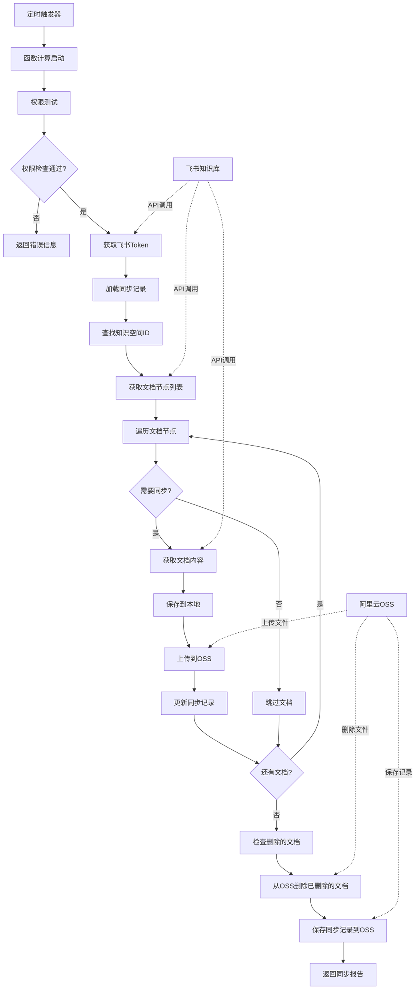

# 飞书知识库同步工具

这是一个基于阿里云函数计算的飞书知识库自动同步工具，可以将飞书知识库中的文档自动同步到阿里云OSS存储，支持增量更新和智能跳过未修改文档。

## 系统架构



## 前置条件

### 1. 飞书应用配置

#### 创建企业自建应用
1. 登录[飞书开发者后台](https://open.feishu.cn/app)
2. 创建企业自建应用
3. 获取 `App ID` 和 `App Secret`

#### 配置应用权限
在应用的**权限管理**页面，开通以下API权限：

| 权限名称 | 权限标识 | 权限类型 | 说明 |
|---------|---------|---------|------|
| 查看云文档内容 | `docs:document.content:read` | 应用身份 | 必需，用于获取文档内容 |
| 查看知识空间列表 | `wiki:space:retrieve` | 应用身份 | 必需，用于获取知识库列表 |
| 查看、编辑和管理知识库 | `wiki:wiki` | 应用身份 | 必需，用于访问知识库节点 |

#### 授权应用访问知识库

**将应用添加为知识库管理员（成员）**

- 在飞书客户端中创建一个群聊，并将应用添加至群聊中。
- 知识库管理员前往「知识库设置」-> 「成员设置」->「添加管理员」中。

- 搜索包含机器人的群聊，添加该群为管理员。


> 详情参考：https://open.feishu.cn/document/server-docs/docs/wiki-v2/wiki-qa#b5da330b

### 2. 阿里云资源准备

- **函数计算服务**：用于运行同步程序
- **OSS存储桶**：用于存储同步的文档文件
- **RAM角色**：函数计算需要访问OSS的权限

## 部署步骤

### 1. 上传代码文件

### 2. 配置环境变量

在函数计算控制台配置以下环境变量：

```json
{
  "FEISHU_APP_ID": "cli_xxxxxxxxxxxxxxxxx",
  "FEISHU_APP_SECRET": "your_app_secret_here",
  "WIKI_SPACE_NAME": "规章制度",
  "OSS_ENDPOINT": "https://oss-cn-beijing.aliyuncs.com",
  "OSS_BUCKET_NAME": "your-knowledge-base-bucket",
  "OSS_PREFIX": "wiki/",
  "MAX_RETRIES": "3",
  "RETRY_DELAY_BASE": "1.0"
}
```

**环境变量说明：**

| 变量名 | 必需 | 说明 | 示例值 |
|-------|------|------|--------|
| `FEISHU_APP_ID` | ✅ | 飞书应用ID | `cli_xxxxxxxxxxxxxxxxx` |
| `FEISHU_APP_SECRET` | ✅ | 飞书应用密钥 | `your_app_secret_here` |
| `WIKI_SPACE_NAME` | ✅* | 知识库名称 | `规章制度` |
| `WIKI_SPACE_ID` | ✅* | 知识库ID | `7599113664066505941` |
| `OSS_ENDPOINT` | ✅ | OSS访问地址 | `https://oss-cn-beijing.aliyuncs.com` |
| `OSS_BUCKET_NAME` | ✅ | OSS存储桶名称 | `your-bucket-name` |
| `OSS_PREFIX` | ❌ | OSS路径前缀 | `wiki/` |
| `MAX_RETRIES` | ❌ | 最大重试次数 | `3` |
| `RETRY_DELAY_BASE` | ❌ | 重试基础延迟(秒) | `1.0` |

> *注：`WIKI_SPACE_NAME` 和 `WIKI_SPACE_ID` 至少提供一个

### 3. 配置触发器

#### 定时触发器（推荐）
```yaml
triggers:
  - name: wiki-sync-timer
    type: timer
    config: 
      cronExpression: "0 0 2 * * *"  # 每天凌晨2点执行
      enable: true
```

#### HTTP触发器（用于手动触发）
```yaml
triggers:
  - name: wiki-sync-http
    type: http
    config:
      authType: anonymous
      methods:
        - GET
        - POST
```

### 4. 设置服务角色

为函数计算服务配置RAM角色，确保具备以下权限：

```json
{
  "Version": "1",
  "Statement": [
    {
      "Action": [
        "oss:PutObject",
        "oss:GetObject",
        "oss:DeleteObject",
        "oss:ListObjects"
      ],
      "Resource": [
        "acs:oss:*:*:your-bucket-name/*"
      ],
      "Effect": "Allow"
    }
  ]
}
```

## 使用方法

### 手动触发
```bash
# 通过HTTP触发器
curl -X POST https://your-function-endpoint.fc.aliyuncs.com/wiki-sync

# 通过控制台测试
# 在函数计算控制台点击"测试函数"
```

### 查看执行结果
成功执行后返回同步报告：
```json
{
  "code": 0,
  "message": "同步完成",
  "space_id": "7599113664066505941",
  "space_name": "规章制度",
  "total_nodes": 15,
  "doc_nodes": 9,
  "successful": 5,
  "failed": 0,
  "skipped": 4,
  "deleted": 0,
  "sync_records_count": 9,
  "api_calls_saved": 4
}
```

### 文件存储结构
同步后的文件在OSS中的存储结构：
```
wiki/
├── 规章制度/
│   ├── 员工管理制度.md
│   ├── 薪酬福利制度.md
│   ├── 人力资源制度.md
│   └── 绩效评估制度.md
├── sync_records.json         # 同步记录文件
└── other-space/
    └── ...
```

## 监控和日志

### 关键日志信息
```log
# 权限测试
✓ 获取access_token成功
✓ 获取知识空间列表成功，共 3 个空间

# 同步优化
文档编辑时间已变化: 1640995200 -> 1640995260 (员工管理制度)
文档无变化，跳过同步: 薪酬福利制度

# 执行统计
同步完成 - 成功: 5, 失败: 0, 跳过: 4, 删除: 0
```

### 错误排查
常见错误及解决方案：

| 错误信息 | 原因 | 解决方案 |
|---------|------|---------|
| `获取access_token失败` | App ID或Secret错误 | 检查环境变量配置 |
| `API权限测试失败` | API权限未开通 | 在开发者后台开通必需权限 |
| `未找到知识空间` | 空间名称错误或无权限 | 检查空间名称，确认应用已获得授权 |
| `获取文档内容失败` | 文档权限不足 | 将应用添加为知识库管理员或文档协作者 |
| `限流错误` | API调用过于频繁 | 程序会自动重试，无需手动处理 |

## TODO

- [ ] 集成 Serverless Devs 工具支持
- [ ] 添加 OSS 触发器函数，处理以下事件：
  - [ ] 文件删除事件处理
  - [ ] 文件更新事件处理  
  - [ ] 文件创建事件处理
- [ ] 支持更多文档类型同步
- [ ] 添加同步状态通知机制
- [ ] 支持多知识空间并发同步

## 注意事项

1. **权限配置**：确保飞书应用具备足够的API权限，且已被添加为知识库管理员
2. **限流处理**：程序内置了限流重试机制，但建议避免过于频繁的手动触发
3. **文档格式**：目前仅支持新版文档(docx)，其他类型文档将被跳过
4. **中文支持**：OSS完全支持中文文件名，无需担心编码问题
5. **成本优化**：通过编辑时间比较大幅减少API调用，降低使用成本

## 故障排除

### 权限问题
如果遇到权限相关错误，请按以下步骤检查：
1. 确认应用已开通必需的API权限
2. 确认应用已被添加为知识库管理员或协作者
3. 查看函数执行日志中的权限测试结果

### 限流问题
程序内置了限流处理机制：
- 自动检测限流错误并重试
- 使用指数退避算法避免连续触发限流
- 合理控制并发数

### 同步异常
如果发现同步结果异常：
1. 检查`sync_records.json`文件内容
2. 查看函数执行日志
3. 手动触发单次同步进行测试

---

通过这个工具，您可以实现飞书知识库到阿里云OSS的自动化同步，为后续的知识处理和AI应用提供支持。
