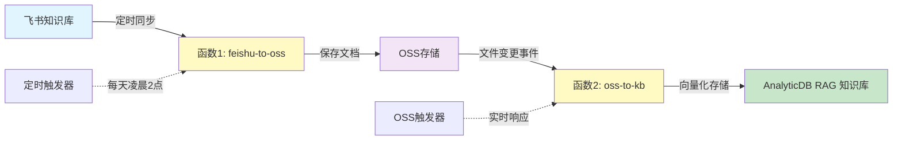

# 飞书知识库自动同步解决方案

这是一个基于阿里云函数计算的完整解决方案，实现飞书知识库到 AnalyticDB PostgreSQL RAG 向量数据库的自动同步。系统由两个核心服务组成，实现定时同步和实时响应的完整闭环。

## 系统架构



**工作流程：**

1. **定时同步**：每天凌晨2点，函数1 从飞书知识库拉取文档并保存到 OSS
2. **实时响应**：OSS 文件变更后立即触发函数2，自动同步到 AnalyticDB 知识库
3. **智能优化**：通过编辑时间比较，只同步变更的文档，大幅减少 API 调用

## 核心功能

### 服务1：飞书到 OSS 同步（feishu-to-oss）

- ✅ **定时同步**：自动从飞书知识库拉取文档
- ✅ **增量更新**：智能识别文档变化，只同步必要内容
- ✅ **完整记录**：维护同步状态，支持断点续传
- ✅ **权限测试**：自动验证飞书 API 权限
- ✅ **删除同步**：自动清理已删除的文档

### 服务2：OSS 到知识库同步（oss-to-kb）

- ✅ **实时响应**：OSS 文件变更后立即处理
- ✅ **智能过滤**：自动跳过系统文件和不支持的格式
- ✅ **完整 CRUD**：支持文档创建、更新、删除的完整生命周期
- ✅ **元数据保留**：自动提取路径信息作为文档元数据
- ✅ **错误重试**：完善的异常处理和重试机制

## 前置准备

### 1. 飞书应用配置

#### 1.1 创建企业自建应用

1. 登录 [飞书开发者后台](https://open.feishu.cn/app)
2. 点击「创建企业自建应用」
3. 获取 `App ID` 和 `App Secret`

#### 1.2 配置 API 权限

在应用的「权限管理」页面，开通以下权限：

| 权限名称 | 权限标识 | 权限类型 | 说明 |
|---------|---------|---------|------|
| 查看云文档内容 | `docs:document.content:read` | 应用身份 | 获取文档内容 |
| 查看知识空间列表 | `wiki:space:retrieve` | 应用身份 | 获取知识库列表 |
| 查看、编辑和管理知识库 | `wiki:wiki` | 应用身份 | 访问知识库节点 |

#### 1.3 授权应用访问知识库

**方法：将应用添加为知识库管理员**

1. 在飞书客户端创建群聊，并将应用添加至群聊
2. 知识库管理员前往「知识库设置」→「成员设置」→「添加管理员」
3. 搜索包含机器人的群聊，添加该群为管理员


> 详情参考：https://open.feishu.cn/document/server-docs/docs/wiki-v2/wiki-qa#b5da330b

### 2. 阿里云资源准备

#### 2.1 AnalyticDB PostgreSQL 实例

1. 创建支持 RAG Service 的实例
2. 创建命名空间和设置密码
3. 创建文档集合（Collection）

#### 2.2 OSS 存储桶

1. 创建 OSS 存储桶（建议与函数在同一区域）
2. 配置访问权限

#### 2.3 RAM 角色权限

函数计算服务角色需要以下权限：

```json
{
  "Version": "1",
  "Statement": [
    {
      "Effect": "Allow",
      "Action": [
        "oss:PutObject",
        "oss:GetObject",
        "oss:DeleteObject",
        "oss:ListObjects"
      ],
      "Resource": "acs:oss:*:*:your-bucket-name/*"
    },
    {
      "Effect": "Allow",
      "Action": [
        "gpdb:UploadDocumentAsync",
        "gpdb:UploadDocumentAsyncAdvance",
        "gpdb:DeleteDocument",
        "gpdb:DescribeDocument"
      ],
      "Resource": "acs:gpdb:*:*:dbinstance/gp-*"
    }
  ]
}
```

## 快速部署

### 方式一：使用 Serverless Devs（推荐）

#### 1. 安装 Serverless Devs

```bash
npm install -g @serverless-devs/s
```

#### 2. 配置访问凭证

```bash
s config add
```

#### 3. 配置参数文件

创建 `s.params.yaml`：

```yaml
access: default
region: cn-hangzhou
roleArn: acs:ram::your-account-id:role/AliyunFCDefaultRole

# 飞书配置
feishuAppId: cli_xxxxxxxxxxxxxxxx
feishuAppSecret: your-feishu-app-secret
wikiSpaceName: 规章制度

# OSS配置
ossBucketName: feishu-test-agentrun
ossPrefix: wiki/

# AnalyticDB配置
gpdbInstanceId: gp-bp1z4n1v00a96rv95
gpdbCollection: document
gpdbNamespace: anycodes
gpdbNamespacePassword: YourPassword123!

# 定时任务配置
cronExpression: "0 0 2 * * *"
```

#### 4. 部署应用

```bash
# 部署所有服务
s deploy

# 仅部署飞书同步服务
s feishu-to-oss deploy

# 仅部署知识库同步服务
s oss-to-kb deploy
```

### 方式二：控制台手动部署

#### 1. 部署 feishu-to-oss 函数

**环境变量配置：**

```json
{
  "FEISHU_APP_ID": "cli_xxxxxxxxxxxxxxxx",
  "FEISHU_APP_SECRET": "your-app-secret",
  "WIKI_SPACE_NAME": "规章制度",
  "OSS_ENDPOINT": "https://oss-cn-hangzhou.aliyuncs.com",
  "OSS_BUCKET_NAME": "feishu-test-agentrun",
  "OSS_PREFIX": "wiki/"
}
```

**触发器配置：**

- **定时触发器**：`0 0 2 * * *`（每天凌晨2点）
- **HTTP触发器**：用于手动触发（可选）

#### 2. 部署 oss-to-kb 函数

**环境变量配置：**

```json
{
  "GPDB_INSTANCE_ID": "gp-bp1z4n1v00a96rv95",
  "GPDB_REGION_ID": "cn-hangzhou",
  "GPDB_COLLECTION": "document",
  "GPDB_NAMESPACE": "anycodes",
  "GPDB_NAMESPACE_PASSWORD": "YourPassword123!",
  "OSS_TRIGGER_BUCKET": "feishu-test-agentrun",
  "OSS_PREFIX_FILTER": "wiki/"
}
```

**触发器配置：**

```yaml
bucketName: feishu-test-agentrun
events:
  - oss:ObjectCreated:PutObject
  - oss:ObjectCreated:PostObject
  - oss:ObjectCreated:CompleteMultipartUpload
  - oss:ObjectCreated:PutSymlink
filter:
  prefix: wiki/
  suffix: ""
```

## 配置说明

### 环境变量详解

#### feishu-to-oss 服务

| 变量名 | 必需 | 说明 | 示例值 |
|-------|------|------|--------|
| `FEISHU_APP_ID` | ✅ | 飞书应用ID | `cli_xxxxxxxxxxxxxxxx` |
| `FEISHU_APP_SECRET` | ✅ | 飞书应用密钥 | `your-app-secret` |
| `WIKI_SPACE_NAME` | ✅* | 知识库名称 | `规章制度` |
| `WIKI_SPACE_ID` | ✅* | 知识库ID | `7599113664066505941` |
| `OSS_ENDPOINT` | ✅ | OSS访问端点 | `https://oss-cn-hangzhou.aliyuncs.com` |
| `OSS_BUCKET_NAME` | ✅ | OSS存储桶名称 | `feishu-test-agentrun` |
| `OSS_PREFIX` | ❌ | OSS路径前缀 | `wiki/` |

> *注：`WIKI_SPACE_NAME` 和 `WIKI_SPACE_ID` 至少提供一个

#### oss-to-kb 服务

| 变量名 | 必需 | 说明 | 示例值 |
|-------|------|------|--------|
| `GPDB_INSTANCE_ID` | ✅ | AnalyticDB实例ID | `gp-bp1z4n1v00a96rv95` |
| `GPDB_REGION_ID` | ✅ | 实例所在区域 | `cn-hangzhou` |
| `GPDB_COLLECTION` | ✅ | 文档集合名称 | `document` |
| `GPDB_NAMESPACE` | ✅ | 命名空间 | `anycodes` |
| `GPDB_NAMESPACE_PASSWORD` | ✅ | 命名空间密码 | `YourPassword123!` |
| `OSS_TRIGGER_BUCKET` | ✅ | OSS触发器存储桶 | `feishu-test-agentrun` |
| `OSS_PREFIX_FILTER` | ✅ | 文件路径前缀过滤 | `wiki/` |

### 支持的文件类型

oss-to-kb 服务支持以下文件格式：

| 类型 | 扩展名 |
|-----|--------|
| 文档 | `.md`, `.txt`, `.pdf`, `.docx`, `.doc` |
| 网页 | `.html`, `.htm` |
| 数据 | `.json`, `.csv` |
| 代码 | `.py`, `.java`, `.cpp`, `.js`, `.ts`, `.go` 等 |
| 配置 | `.xml`, `.yaml`, `.yml`, `.toml` |

### 自动忽略的文件

以下文件会被自动跳过：

- `sync_records.json` - 同步记录文件
- `.DS_Store`, `Thumbs.db` - 系统文件
- `.git*` - Git 相关文件
- 以 `.` 开头的隐藏文件
- 以 `~` 结尾的临时文件
- `.tmp`, `.bak`, `.swp` 等临时文件

## 使用方法

### 手动触发同步

```bash
# 通过 HTTP 触发器手动触发
curl -X POST https://your-function-endpoint.fc.aliyuncs.com

# 通过 Serverless Devs 调用
s feishu-to-oss invoke

# 通过控制台
# 在函数计算控制台点击「测试函数」
```

### 测试 OSS 同步

```bash
# 上传测试文件到 OSS
echo "测试内容" > test.md
ossutil cp test.md oss://feishu-test-agentrun/wiki/test.md

# 查看函数日志
s oss-to-kb logs --tail
```

### 查看执行结果

#### feishu-to-oss 同步报告

```json
{
  "code": 0,
  "message": "同步完成",
  "space_id": "7599113664066505941",
  "space_name": "规章制度",
  "total_nodes": 15,
  "doc_nodes": 9,
  "successful": 5,
  "failed": 0,
  "skipped": 4,
  "deleted": 0,
  "sync_records_count": 9,
  "api_calls_saved": 4
}
```

#### oss-to-kb 处理结果

```json
{
  "statusCode": 200,
  "body": {
    "success": true,
    "message": "OSS事件处理完成",
    "event_name": "ObjectCreated:PutObject",
    "file_info": {
      "bucket_name": "feishu-test-agentrun",
      "object_key": "wiki/规章制度/员工管理制度.md",
      "file_name": "员工管理制度.md"
    },
    "result": {
      "action": "upload",
      "status": "success",
      "job_id": "231460f8-75dc-405e-a669-0c5204887e91",
      "file_size": 12345,
      "metadata": {
        "source": "feishu_wiki",
        "space": "规章制度",
        "title": "员工管理制度",
        "file_type": "md"
      }
    }
  }
}
```

## 文件存储结构

OSS 中的文件组织结构：

```
wiki/
├── 规章制度/
│   ├── 员工管理制度.md
│   ├── 薪酬福利制度.md
│   ├── 人力资源制度.md
│   └── 绩效评估制度.md
├── 技术文档/
│   ├── 开发规范.md
│   └── API文档.md
└── sync_records.json  # 同步记录（自动维护）
```

## 监控和日志

### 关键日志示例

#### feishu-to-oss 服务

```log
✓ 获取access_token成功
✓ 获取知识空间列表成功，共 3 个空间
✓ 找到目标知识空间: 规章制度 (ID: 7599113664066505941)

文档编辑时间已变化: 1640995200 -> 1640995260 (员工管理制度)
文档无变化，跳过同步: 薪酬福利制度

同步完成 - 成功: 5, 失败: 0, 跳过: 4, 删除: 0
本次同步节省API调用: 4 次
```

#### oss-to-kb 服务

```log
开始处理OSS触发事件
提取文件信息:
  Bucket: feishu-test-agentrun
  对象键: wiki/规章制度/员工管理制度.md
  文件名: 员工管理制度.md
  事件类型: ObjectCreated:PutObject

✓ 文件符合处理条件
步骤1: 从OSS下载文件
成功下载文件: wiki/规章制度/员工管理制度.md, 大小: 12345 字节

步骤2: 上传到AnalyticDB
✓ 文档上传任务已提交
  JobId: 231460f8-75dc-405e-a669-0c5204887e91
  文件名: 员工管理制度.md
```

## 故障排查

### 常见问题

#### 1. 飞书权限问题

**错误信息：** `获取access_token失败` 或 `API权限测试失败`

**解决方案：**
- 检查 `FEISHU_APP_ID` 和 `FEISHU_APP_SECRET` 是否正确
- 确认应用已开通必需的 API 权限
- 确认应用已被添加为知识库管理员

#### 2. AnalyticDB 连接失败

**错误信息：** `AccountOrPassword.VerificationError` 或 `MissingRegionId`

**解决方案：**
- 确认 `GPDB_INSTANCE_ID` 正确
- 确认 `GPDB_NAMESPACE` 和 `GPDB_NAMESPACE_PASSWORD` 正确
- 检查 `GPDB_REGION_ID` 是否与实例区域一致

#### 3. OSS 访问失败

**错误信息：** `下载文件失败` 或 `上传失败`

**解决方案：**
- 检查函数计算服务角色的 OSS 权限
- 确认 OSS 存储桶名称正确
- 检查网络连通性

#### 4. 文件被跳过

**日志信息：** `⊗ 跳过: 文件不在处理范围内`

**解决方案：**
- 检查文件路径是否符合 `OSS_PREFIX_FILTER` 设置
- 确认文件类型在支持列表中
- 检查是否是被忽略的系统文件

### 调试技巧

```bash
# 查看实时日志
s logs --tail -f

# 查看最近的执行日志
s logs --start-time "2024-01-01 00:00:00"

# 本地调试
s local invoke -e '{"key": "value"}'

# 查看函数信息
s info
```

## 性能优化

### 1. 同步策略优化

- **增量同步**：通过编辑时间比较，只同步变更文档
- **API调用优化**：智能跳过未修改文档，减少 API 调用
- **批量处理**：合理控制并发数，避免限流

### 2. 文档处理参数调优

可在 oss-to-kb 代码中调整以下参数：

```python
request = UploadDocumentAsyncAdvanceRequest(
    chunk_size=500,              # 分块大小（建议 300-1000）
    chunk_overlap=50,            # 分块重叠（建议 chunk_size 的 10%）
    text_splitter_name='ChineseRecursiveTextSplitter',  # 中文优化
    document_loader_name='UnstructuredFileLoader'       # 通用加载器
)
```

### 3. 成本控制

- 合理设置定时任务频率
- 使用文件过滤减少不必要的处理
- 监控 AnalyticDB 的存储和 API 调用量

## 高级功能

### 多知识库支持

修改 `WIKI_SPACE_NAME` 为逗号分隔的多个知识库：

```yaml
WIKI_SPACE_NAME: "规章制度,技术文档,产品手册"
```

### 自定义元数据

在 oss-to-kb 代码中扩展元数据提取：

```python
metadata = {
    'source': 'feishu_wiki',
    'space': path_parts[1],
    'title': os.path.splitext(path_parts[-1])[0],
    'file_type': file_ext.lstrip('.'),
    'sync_timestamp': str(int(time.time())),
    'custom_field': 'custom_value'  # 自定义字段
}
```

### 监控告警

建议配置以下监控指标：

- 函数调用次数和错误率
- 函数执行时长
- AnalyticDB API 调用量
- OSS 存储使用量

## 注意事项

1. **权限配置**：确保飞书应用具备足够权限，且已被添加为知识库管理员
2. **区域一致性**：建议所有资源（函数、OSS、AnalyticDB）在同一区域
3. **文档大小**：单个文档建议不超过 200MB
4. **API 限流**：飞书和 AnalyticDB 都有 API 调用频率限制，注意控制
5. **异步处理**：AnalyticDB 文档上传是异步的，可通过 JobId 查询状态
6. **中文支持**：完整支持中文文件名和内容，无需担心编码问题
7. **成本优化**：通过增量同步和智能跳过，大幅降低 API 调用成本

## 技术支持

- **GitHub Issues**: [提交问题](https://github.com/devsapp/feishuks/issues)
- **文档**: [Serverless Devs 文档](https://www.serverless-devs.com/)

---

通过这套完整解决方案，您可以轻松实现飞书知识库到 AnalyticDB RAG 向量数据库的自动同步，为企业 AI 应用提供实时更新的知识支撑。
